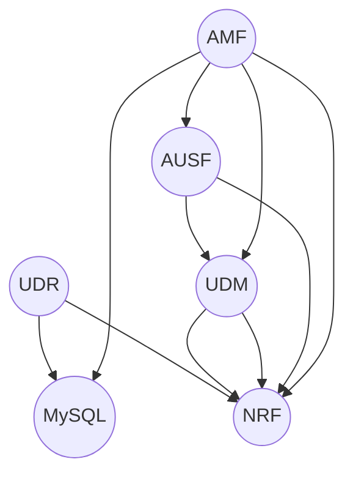

# Deploy Charmed OAI 5G

## Requirements

- **Kubernetes**: A cluster with a total of a minimum of 6 vCPUs and 16 GB of RAM.
- **Juju**: A Juju controller with access to the Kubernetes cluster

## Getting Started

Install microk8s with the necessary add-ons:

```bash
snap install microk8s --classic
microk8s enable dns
microk8s enable storage
```

## Install the OAI 5G Core 

Install MicroK8s with the necessary add-ons:

```bash
snap install microk8s --classic
microk8s enable dns
microk8s enable storage
microk8s enable community
microk8s enable multus
```

## Deploy the 5G Core

Deploy the charms:

```bash
juju deploy mysql-k8s --channel=edge --trust
juju deploy oai-5g-nrf --channel=edge --trust
juju deploy oai-5g-udr --channel=edge --trust
juju deploy oai-5g-udm --channel=edge --trust
juju deploy oai-5g-ausf --channel=edge --trust
```

Relate the charms:

```bash
juju relate mysql-k8s oai-5g-udr
juju relate oai-5g-nrf oai-5g-udr
juju relate oai-5g-nrf oai-5g-udm
juju relate oai-5g-udr oai-5g-udm
juju relate oai-5g-ausf oai-5g-udm
juju relate oai-5g-ausf oai-5g-nrf
```

## Reference


