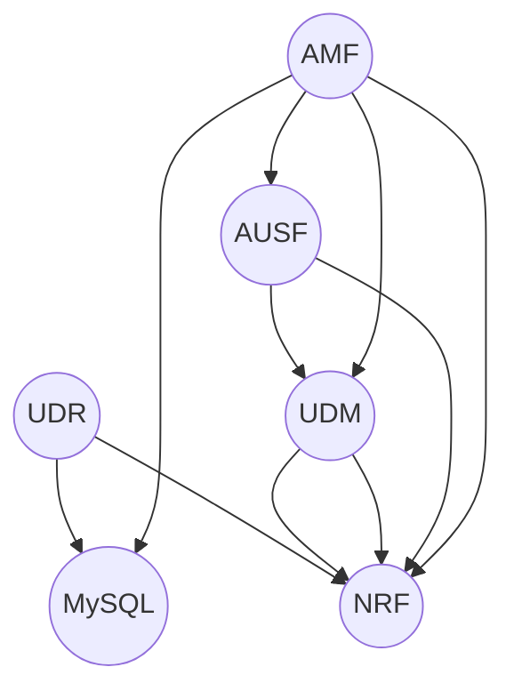

# Model

```mermaid
flowchart TD;
      udr((UDR))-->mysql((MySQL))
      udr((UDR))-->nrf((NRF))
      udm((UDM))-->nrf((NRF))
      udm((UDM))-->nrf((NRF))
      ausf((AUSF))-->nrf((NRF))
      ausf((AUSF))-->udm((UDM))
      amf((AMF))-->mysql((MySQL))
      amf((AMF))-->nrf((NRF))
      amf((AMF))-->udm((UDM))
      amf((AMF))-->ausf((AUSF))
```
