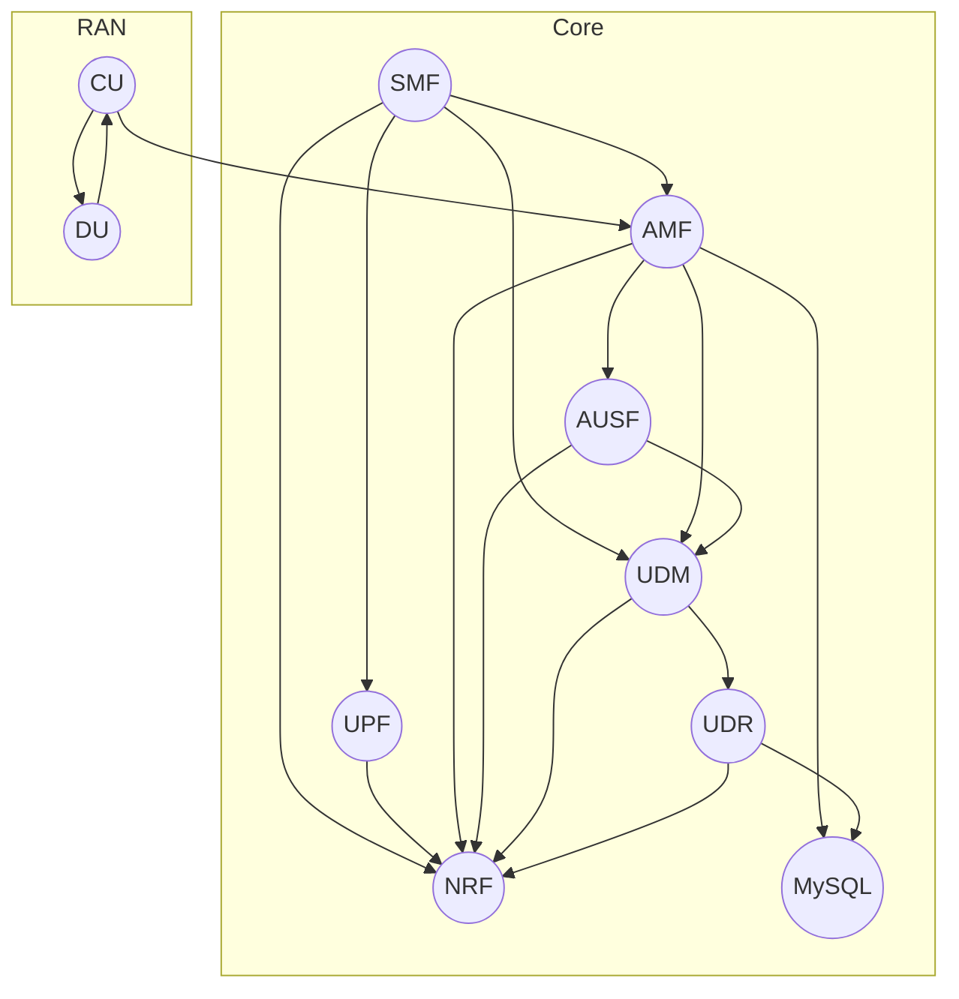

# Model

```mermaid
flowchart TD;
    subgraph Core
        smf((SMF))-->amf((AMF))
        smf((SMF))-->nrf((NRF))
        smf((SMF))-->udm((UDM))
        smf((SMF))-->upf((UPF))
        upf((UPF))-->nrf((NRF))
        amf((AMF))-->ausf((AUSF))
        amf((AMF))-->udm((UDM))
        amf((AMF))-->nrf((NRF))
        amf((AMF))-->mysql((MySQL))
        ausf((AUSF))-->udm((UDM))
        ausf((AUSF))-->nrf((NRF))
        udm((UDM))-->nrf((NRF))
        udm((UDM))-->udr((UDR))
        udr((UDR))-->mysql((MySQL))
        udr((UDR))-->nrf((NRF))
      end
      subgraph RAN
        cu((CU))-->amf((AMF))
        cu((CU))-->du((DU))
        du((DU))-->cu((CU))
      end
      click smf "https://charmhub.io/oai-5g-smf"
      click upf "https://charmhub.io/oai-5g-upf"
      click amf "https://charmhub.io/oai-5g-amf"
      click ausf "https://charmhub.io/oai-5g-ausf"
      click udm "https://charmhub.io/oai-5g-udm"
      click udr "https://charmhub.io/oai-5g-udr"
      click nrf "https://charmhub.io/oai-5g-nrf"
      click mysql "https://charmhub.io/mysql-k8s"
      click cu "https://charmhub.io/oai-5g-cu"
      click du "https://charmhub.io/oai-5g-du"
```
