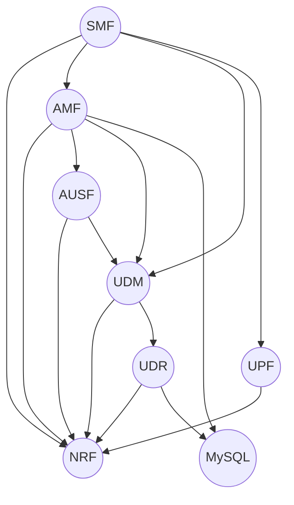

# Model

## Charmhub links

- [oai-5g-amf](https://charmhub.io/oai-5g-amf)
- [oai-5g-ausf](https://charmhub.io/oai-5g-ausf)
- [oai-5g-nrf](https://charmhub.io/oai-5g-nrf)
- [oai-5g-udm](https://charmhub.io/oai-5g-udm)
- [oai-5g-udr](https://charmhub.io/oai-5g-udr)
- [oai-5g-upf](https://charmhub.io/oai-5g-upf)
- [oai-5g-smf](https://charmhub.io/oai-5g-smf)
